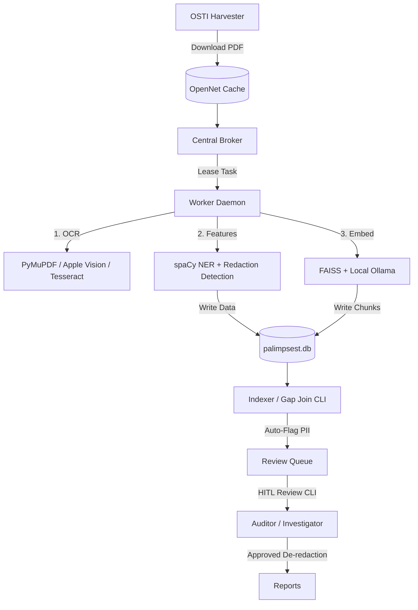

# Palimpsest

Palimpsest is a high-throughput, cross-document corroboration system designed to systematically recover redacted text from the Department of Energy's OpenNet database (specifically the `NV*` Nevada Test Site accession series).

By comparing documents where information is blacked out in one source but left in the clear in another, Palimpsest locates and links verified de-redactions while strictly preserving provenance and subject identity protection.

## Core Architecture

Palimpsest is divided into two operational lanes:
- **Lane A (Orchestration)**: Manages routing, agentic analysis, and human-in-the-loop interactions. Includes a read-only FastMCP server (`palimpsest.server`) to integrate research agents safely into the workspace.
- **Lane B (Bulk Grind)**: A high-throughput OCR, entity extraction (NER), and embedding-based indexing engine coordinating worker nodes via a SQLite-backed central job broker.



## System Workflow & Components

### 1. Job Broker & Workers (`palimpsest/broker.py`, `palimpsest/worker.py`)
- FastAPI-based broker coordinates queue management (`/enqueue`, `/lease`, `/complete`, `/fail`).
- Worker daemons lease tasks, refresh heartbeats, and stream PDF/JSON payloads. Supports fallback nodes running on macOS M-series (Apple Vision OCR) and Linux (Tesseract OCR).

### 2. OCR & Feature Extraction (`palimpsest/tasks/ocr.py`, `palimpsest/tasks/features.py`)
- Extracts text via PyMuPDF dict coordinates, falling back to Apple Vision (`ocrmac`) or Tesseract.
- Identifies redactions (black-box contours or text markers like `[deleted]`) and extracts spaCy entities (`person`, `org`, `date`, `dosage`, `reg_cite`, `seq_ref`).

### 3. Vector Indexing & Gap Join (`palimpsest/indexer.py`, `palimpsest/tasks/embed.py`)
- Chunks document text and generates sequential batch embeddings (using `nomic-embed-text` via Ollama).
- Builds a FAISS index and runs the redaction-gap join algorithm to rank clear-text entities matching redacted contexts across different document IDs.

### 4. Finding-Type engines
- **Type a**: Redacted text corroboration (cross-document context similarity join).
- **Type e**: Temporal regulatory-violation citations (comparing document year against effective date of CFR/Belmont/Helsinki rules).
- **Type f**: Series suppression gap analyzer (accession-range sequencing gap scans).

### 5. Identity Gate & HITL CLI (`palimpsest/review.py`, `palimpsest/server.py`)
- Enforces Iron Rule #3: No subject is unmasked without individual human approval or verification of a safety heuristic (e.g., document age > 75 years, or subject age at document date > 100 years).
- Pseudonymizes unapproved individuals as `PERSON-XXXX` across all MCP and report outputs.
- Logs decisions securely via SHA-256 hashes of norm names to `{storage_root}/db/review_audit.jsonl`.

## Installation & Setup

Ensure you have Python 3.13+, `uv`, and `tesseract` (if running Tesseract fallback OCR).

```bash
# Clone the repository
git clone https://github.com/ehurrn/palimpsest.git
cd palimpsest

# Install dependencies and sync virtual environment
uv sync

# Run database migration to schema version 3
uv run python -m palimpsest.db migrate

# Run preflight environment checks
uv run python -m palimpsest.preflight
```

## Running the Pipeline

### 1. Launch Broker & Services
```bash
# Start the central broker
uv run uvicorn palimpsest.broker:app --host 0.0.0.0 --port 8077

# Start the FastMCP server
uv run python -m palimpsest.server

# Start worker daemon on a node
uv run python -m palimpsest.worker --node m4
```

### 2. Harvester & Indexing
```bash
# Fetch search metadata and catalog documents
uv run python -m palimpsest.harvester catalog --limit 1000
uv run python -m palimpsest.harvester fetch --limit 1000

# Build vector index
uv run python -m palimpsest.indexer build

# Execute gap join and violation analyzer
uv run python -m palimpsest.indexer gapjoin
uv run python -m palimpsest.indexer violationjoin
```

### 3. Review CLI
```bash
# Launch interactive HITL person review
uv run python -m palimpsest.review people

# Launch interactive gap candidate review
uv run python -m palimpsest.review gaps

# Run automatic age safety heuristics
uv run python -m palimpsest.review heuristic
```

## Running Tests

All modules include robust unit testing. Run the pytest suite:

```bash
uv run pytest
```

## License
Proprietary OSINT research tool. All rights reserved.
